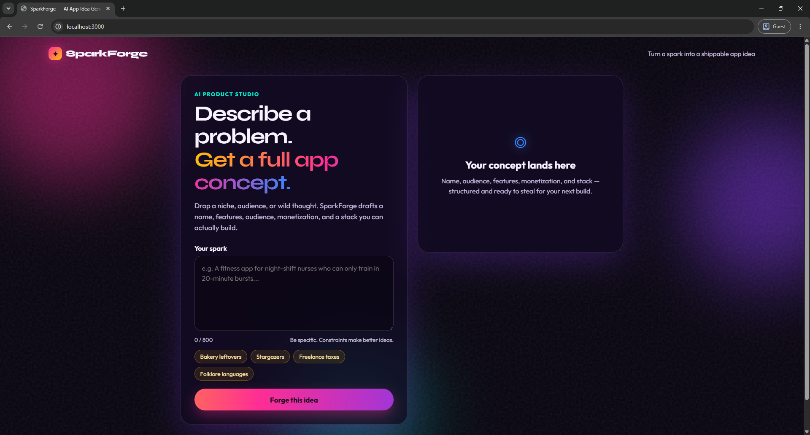

# ✦ SparkForge — AI App Idea Generator

> Turn a spark into a shippable app idea.

**SparkForge** is a simple AI-powered web application that transforms a user's rough app concept, problem, niche, or idea into a structured application concept using the OpenAI API.

This project was built primarily as a **learning and skill-enhancement project** to practice building an AI-integrated full-stack web application, working with APIs, backend routes, frontend interactions, environment variables, and modern JavaScript development.

---

## 🚀 Overview

Coming up with a good application idea can sometimes be harder than building it.

SparkForge allows you to enter a simple idea such as:

> "A fitness app for night-shift nurses who can only train in 20-minute bursts."

The application sends the prompt to an AI model and generates a structured concept containing:

- 💡 App Name
- 📝 One-line Description
- 🎯 Target Audience
- ⚡ Core Features
- 💎 Unique Value Proposition
- 💰 Monetization Strategy
- 🛠️ Technology Stack Suggestions

The goal is to turn a **small spark of an idea into a practical starting point for development**.

---

## 🎯 Purpose of This Project

This project was created for **learning, experimentation, and improving development skills**.

Through this project, I practiced:

- Building a full-stack JavaScript application
- Working with **Node.js and Express**
- Creating REST API endpoints
- Integrating the **OpenAI API**
- Handling API requests and responses
- Using environment variables securely
- Working with **EJS templates**
- Connecting frontend JavaScript with backend APIs
- Handling asynchronous operations with `async/await`
- Creating responsive and modern UI designs
- Handling frontend loading and error states
- Formatting AI-generated text dynamically
- Working with Git and GitHub

This is **not intended to be a production-ready AI product**. It is a hands-on project created to learn and strengthen practical development skills.

---

## ✨ Features

### 🤖 AI-Powered Idea Generation

Enter your own application concept and let AI expand it into a complete product idea.

### 🧠 Structured AI Responses

The generated concept includes:

1. App Name
2. One-line Description
3. Target Audience
4. Core Features
5. Unique Value Proposition
6. Monetization Strategy
7. Technology Stack Suggestions

### 💭 Example Prompts

The application includes ready-made example prompts for quickly experimenting with different ideas:

- Bakery leftovers marketplace
- Stargazing social application
- Freelancer tax budgeting tool
- Folklore-based language learning application

### 🔢 Character Counter

The prompt input includes an **800-character limit** and live character counter.

### 📋 Copy Generated Idea

Generated results can be copied directly using the **Copy** button.

### ⏳ Loading State

The application provides visual feedback while waiting for the AI response.

### ⚠️ Error Handling

The frontend and backend handle invalid input and API/request errors.

### 📱 Responsive UI

The interface adapts to smaller screen sizes such as tablets and mobile devices.

### 🎨 Modern Interface

The frontend uses a dark glassmorphism-inspired design with animated gradients, glowing elements, and responsive cards.

---

## 📸 UI Screenshots

### 🏠 Main Interface

The main SparkForge interface where users can enter their app idea and generate an AI-powered concept.



---

## 🛠️ Tech Stack

### Backend

- **Node.js**
- **Express.js**
- **OpenAI API**
- **dotenv**

### Frontend

- **HTML5**
- **CSS3**
- **JavaScript**
- **EJS**

### AI

- **OpenAI API**
- Model: `gpt-4o-mini`

### Development Tools

- **npm**
- **Git**
- **GitHub**

---

## 📂 Project Structure

```text
AI-App-Idea-Generator/
│
├── public/
│   ├── css/
│   │   └── style.css
│   │
│   └── js/
│       └── app.js
│
├── Views/
│   └── index.ejs
│
├── server.js
├── package.json
├── package-lock.json
├── .env
└── README.md
```

### Important Files

#### `server.js`

The main Express server.

It:

- Initializes the Express application
- Loads environment variables
- Configures EJS
- Serves static files
- Initializes the OpenAI client
- Handles the `/` route
- Handles the `/generate` API endpoint
- Sends the user's prompt to OpenAI
- Returns the generated idea as JSON

#### `Views/index.ejs`

Contains the main user interface for SparkForge.

It includes:

- Application branding
- Prompt input
- Example prompt buttons
- Generate button
- Loading state
- Error state
- AI result section

#### `public/js/app.js`

Handles frontend functionality such as:

- Prompt character counting
- Example prompt selection
- Form submission
- Calling the backend API
- Loading state
- Error handling
- Rendering generated results
- Copy-to-clipboard functionality

#### `public/css/style.css`

Contains the complete visual styling including:

- Dark theme
- Glassmorphism cards
- Gradient effects
- Animated background orbs
- Responsive layouts
- Buttons
- Form elements
- Result formatting
- Mobile responsiveness

---

## ⚙️ Getting Started

### 1. Clone the Repository

```bash
git clone https://github.com/MalingaBandara/AI-App-Idea-Generator.git
```

### 2. Navigate to the Project

```bash
cd AI-App-Idea-Generator
```

### 3. Install Dependencies

```bash
npm install
```

### 4. Configure Environment Variables

Create a `.env` file in the root directory:

```env
OPENAI_API_KEY=your_openai_api_key
PORT=3000
```

Replace:

```text
your_openai_api_key
```

with your actual OpenAI API key.

> ⚠️ **Important:** Never commit your real API key to GitHub.

### 5. Start the Application

```bash
npm start
```

The application should start on:

```text
http://localhost:3000
```

Open the URL in your browser.

---

## 🔄 How It Works

The application follows a simple request flow:

```text
User enters an idea
        │
        ▼
Frontend JavaScript
        │
        │ POST /generate
        ▼
Express.js Server
        │
        ▼
Prompt + Instructions
        │
        ▼
OpenAI API
        │
        ▼
AI Generated App Concept
        │
        ▼
Express JSON Response
        │
        ▼
Frontend Formats Result
        │
        ▼
User sees the App Idea
```

### Backend Flow

The frontend sends:

```json
{
  "customPrompt": "A fitness app for night-shift nurses"
}
```

to:

```text
POST /generate
```

The server then combines the user's prompt with additional instructions asking the AI to generate a structured application concept.

The OpenAI response is returned to the browser as:

```json
{
  "success": true,
  "idea": "..."
}
```

---

## 🔌 API Endpoint

### Generate App Idea

**Endpoint**

```http
POST /generate
```

**Request**

```json
{
  "customPrompt": "A marketplace for local farmers"
}
```

**Successful Response**

```json
{
  "success": true,
  "idea": "..."
}
```

**Validation Error**

```json
{
  "success": false,
  "error": "Custom prompt is required"
}
```

---

## 🧠 AI Prompt Design

The application doesn't simply send the user's text directly to the AI.

It combines the user's input with structured instructions asking the model to provide:

```text
1. App Name
2. One-line Description
3. Target Audience
4. Core Features
5. Unique Value Proposition
6. Monetization Strategy
7. Technology Stack Suggestions
```

The system prompt also instructs the model to behave like a:

> Creative product manager and entrepreneur

This helps produce more structured and practical application concepts.

---

## 📚 What I Learned

This project helped me gain practical experience with several concepts.

### Backend Development

- Express application setup
- Middleware
- Routing
- JSON request handling
- HTTP status codes
- Error handling
- Environment configuration

### API Integration

- Initializing an API client
- Sending structured requests
- Handling asynchronous API responses
- Processing API response data
- Managing API errors

### Frontend Development

- DOM manipulation
- Event listeners
- Form handling
- Fetch API
- Async/await
- Dynamic HTML generation
- Loading states
- Error states
- Clipboard API

### UI/UX

I also practiced creating a modern interface instead of focusing only on functionality.

The UI includes:

- Responsive layouts
- Glass-style cards
- Gradient effects
- Animated background elements
- Interactive buttons
- Responsive mobile layout

---


## ⚠️ Disclaimer

This project was created for **educational and skill-development purposes**.

The generated application ideas are AI-generated suggestions and should be independently evaluated before being used for real-world products or businesses.

The project may also incur API usage costs depending on the OpenAI account and API configuration being used.

---

## 👨‍💻 Author

**Malinga Bandara**

Full-Stack Software Engineer | Java & Spring Boot | MERN | AI-Assisted Development

GitHub:

**[@MalingaBandara](https://github.com/MalingaBandara)**

---

## ⭐ Learning Project

If you find this project useful for learning or experimentation, feel free to ⭐ the repository.

> **Build. Learn. Experiment. Improve.**

This project is one of my hands-on experiments for continuously improving my software engineering and AI integration skills.